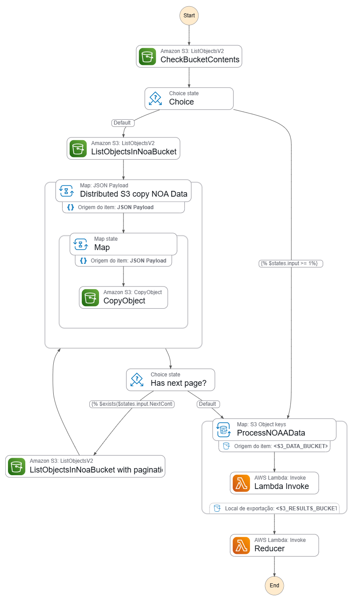

# 🚀 Meus Estudos do Bootcamp AWS - Santander Code Girls

Bem-vindo(a) ao meu repositório de estudos do Bootcamp AWS promovido pela Santander e DIO! Este espaço foi criado para documentar e consolidar todo o conhecimento adquirido, com foco em arquiteturas de nuvem modernas, serverless e microsserviços.

---

## 📜 Tabela de Conteúdos
1. [Introdução: Microsserviços e Serverless](#1-introdução-o-contexto-de-microsserviços-e-serverless)
2. [Componentes Essenciais para Workflows](#2-componentes-essenciais-para-workflows-automatizados)
    - [AWS Lambda](#21-aws-lambda-computação-serverless)
    - [Amazon SNS e SQS](#22-amazon-sns-e-sqs-serviços-de-mensagens-e-notificações)
    - [Amazon ECS e EKS](#23-amazon-ecs-e-eks-serviços-de-contêineres-gerenciados)
3. [Foco Principal: AWS Step Functions](#3-foco-principal-aws-step-functions)
4. [Exemplo Prático: Análise de um Workflow](#exemplo-prático-análise-do-workflow-de-processamento-de-dados)
5. [Como Usar este Repositório](#-como-usar-este-repositório)
6. [Licença](#-licença)

---

## 1. Introdução: O Contexto de Microsserviços e Serverless

Antes de adentrar nos serviços específicos de orquestração, é crucial entender o ambiente arquitetural no qual eles operam:

- **Microservices (Microsserviços):** Com o aumento da popularidade das arquiteturas baseadas em microsserviços, houve um crescimento significativo nos workloads e serviços de contêiner em nuvem. Falar em serviços como `Amazon ECS` e `EKS` exige que se entenda este conceito.
- **Serverless (Sem Servidor):** Serverless é uma arquitetura nativa da nuvem que permite transferir mais responsabilidades operacionais para a AWS, promovendo maior agilidade e inovação.

## 2. Componentes Essenciais para Workflows Automatizados

Os serviços listados abaixo são cruciais e frequentemente integrados em um workflow robusto, muitas vezes orquestrado pelo `AWS Step Functions`.

### 2.1. AWS Lambda (Computação Serverless)

O `AWS Lambda` é um serviço de computação que executa código em resposta a eventos. Ele gerencia automaticamente os recursos de computação, sendo a maneira mais rápida de transformar uma ideia em aplicações de produção modernas e com tecnologia sem servidor.

**Características Principais:**

- **Gerenciamento:** O Lambda executa o código em uma infraestrutura de alta disponibilidade e gerencia toda a administração dos recursos, incluindo manutenção do servidor e do SO, provisionamento e escalabilidade.
- **Custo e Execução:** O código é executado somente quando necessário (execução sob demanda). A cobrança ocorre apenas pelo tempo de computação usado (aproximadamente $0.20 USD por 1 milhão de solicitações).
- **Escalabilidade:** O dimensionamento é feito automaticamente com base no número de eventos recebidos, eliminando a necessidade de gerenciamento manual do servidor.

### 2.2. Amazon SNS e SQS (Serviços de Mensagens e Notificações)

Estes são serviços de mensagens que permitem a comunicação assíncrona entre diferentes partes de um aplicativo, desacoplando os componentes.

| Serviço                                  | Função e Características                                                                                                                                              | Uso Ideal                                                                                                             |
| ---------------------------------------- | --------------------------------------------------------------------------------------------------------------------------------------------------------------------- | --------------------------------------------------------------------------------------------------------------------- |
| **Amazon SNS (Simple Notification Service)** | Serviço de mensagens no padrão Publish/Subscribe (Pub/Sub). Funciona como um sistema de transmissão (broadcast), permitindo notificações push, e-mails ou integrações com SQS e Lambda. | Comunicação instantânea (alertas, notificações). Distribuir uma mesma mensagem para múltiplos consumidores diferentes. |
| **Amazon SQS (Simple Queue Service)** | Sistema de filas de mensagens que desacopla componentes. Garante a entrega de mensagens entre sistemas. Uma mensagem é consumida por um único consumidor.                 | Comunicação assíncrona entre serviços. Suavizar picos de tráfego e garantir que todas as tarefas sejam processadas.   |

### 2.3. Amazon ECS e EKS (Serviços de Contêineres Gerenciados)

`ECS` e `EKS` são serviços de orquestração de contêineres que trabalham com microsserviços. A escolha entre eles depende da maturidade da organização em contêineres e da complexidade da arquitetura.

| Serviço                                    | Descrição e Características                                                                                                                                              | Uso Típico                                                                                                                       |
| ------------------------------------------ | ------------------------------------------------------------------------------------------------------------------------------------------------------------------------ | -------------------------------------------------------------------------------------------------------------------------------- |
| **Amazon ECS (Elastic Container Service)** | Serviço proprietário gerenciado da AWS para orquestração de contêineres Docker. Possui integração nativa e simplificada com o ecossistema AWS (IAM, VPC, CloudWatch) e pode rodar com a tecnologia serverless Fargate. | Ideal para organizações que estão começando a usar contêineres e desejam uma integração profunda e simples com a AWS.          |
| **Amazon EKS (Elastic Kubernetes Service)**| Serviço gerenciado que facilita a execução do Kubernetes (K8s) na AWS. O Kubernetes é um padrão de mercado (open-source) para orquestração.                                | Mais adequado para organizações que já utilizam Kubernetes, planejam uma estratégia multinuvem ou necessitam do ecossistema do K8s. |

## 3. Foco Principal: AWS Step Functions

O `AWS Step Functions` é um serviço de orquestração serverless que permite sequenciar funções e múltiplos serviços da AWS em fluxos de trabalho visuais, chamados de **Máquinas de Estado (State Machines)**.

Ele atua como o "maestro" do workflow, conectando todos os componentes vistos anteriormente (`Lambda`, `SQS`, `ECS`, etc.) em uma lógica de aplicação clara e resiliente.

**Insights e Funcionalidades Chave:**

- **Definição do Workflow:** Você define visualmente a ordem de execução, a lógica de ramificação (decisões) e o processamento paralelo.
- **Tratamento de Erros:** Possui mecanismos nativos de *Retry* (tentar novamente) e *Catch* (capturar erro), o que torna o workflow robusto a falhas.
- **Escalabilidade Integrada:** Aproveita o auto-escalonamento nativo dos serviços que invoca (como Lambda e ECS/Fargate) para suportar a demanda.

---

### Exemplo Prático: Análise do Workflow de Processamento de Dados

O diagrama abaixo ilustra uma máquina de estado do Step Functions para um pipeline de processamento de dados.

**Análise do Fluxo:**

Este workflow automatiza a cópia e o processamento de dados de um bucket S3 para outro. Vamos analisar passo a passo:

1.  **Start:** Início do fluxo.
2.  **CheckBucketContents:** Uma tarefa do tipo `ListObjectsV2` verifica o conteúdo de um bucket S3 inicial.
3.  **Choice:** Um estado de decisão.
    - Se uma condição específica for atendida, o fluxo vai direto para o processamento.
    - Caso contrário (caminho `Default`), ele inicia o processo de cópia.
4.  **ListObjectsInNoaBucket / ... with pagination:** Inicia um loop para listar objetos no bucket de origem, garantindo que todos os objetos sejam processados, mesmo que existam milhares (paginação).
5.  **Distributed S3 copy NOA Data:** Este é um Estado de Mapa (`Map State`). Ele itera sobre a lista de objetos e executa uma tarefa de cópia para cada item em paralelo, acelerando o processo.
6.  **ProcessNOAAData:** Outro Estado de Mapa. Itera sobre as chaves dos objetos no bucket de destino.
7.  **Lambda Invoke:** Para cada objeto, uma função `AWS Lambda` é invocada para processar os dados em paralelo.
8.  **Reducer:** Após o processamento paralelo, uma única função `Lambda` (Reducer) é invocada para consolidar os resultados, gerar um relatório final ou realizar uma ação de limpeza (padrão MapReduce).
9.  **End:** Fim do workflow.

Este exemplo prático demonstra como o Step Functions orquestra múltiplos serviços e utiliza padrões avançados para construir um pipeline de dados robusto e escalável.

## 🔧 Como Usar este Repositório

Este repositório serve como um diário de bordo dos meus estudos. Sinta-se à vontade para navegar pelo conteúdo, usar como referência para seus próprios estudos ou abrir uma *issue* para discutir algum tópico.

## 📄 Licença

Distribuído sob a licença MIT. Veja `LICENSE.txt` para mais informações.
